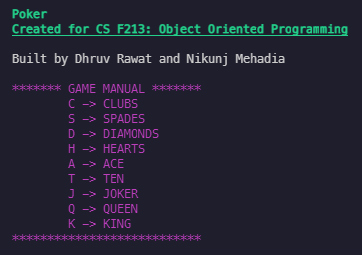

# Texas Hold'em Poker

#### Course Project for CS F213: Object Oriented Programming

## Task

You’ve been asked to simulate a game of Texas Hold‘em Poker. Your application should support upto 4 players playing on a table simultaneously. Players would be dealt 2 cards face down, post which they should be allowed to check, raise, call, or fold as necessary. For learning the rules, you go through the wikipedia page linked above or look at some tutorials on YouTube. After each round of betting, face up cards would be revealed (3 or 1 as the case may be) and then the winner declared in the end.

### Sample Class Design

- **`Table (Dealer)`** : Handles the flow of the game, deals the cards, has the deck.
- **`Player`** : Attributes like `name`, `current chips`, and should support actions like the ones listed in the description
- **`Deck`** : Made up of `Cards`. Should support functionality like deal, and shuffle. 
- **`Card`** : Made of `rank` and `suit`. Should also keep track of whether it is face up or face down and should support functionality to flip it. 

### Sample Input/Output

- The first input would be the name of players and the initial chips that different players have.
- During play, the private cards of all the players, the community cards, and the total amount that has been bet should be on display. If the community cards have not been revealed yet, they should printed as a “*”
- On a player’s turn, he should be presented with a list of all options available to him (call, raise, fold, check etc). If he tries to bet more than the amount of chips available to him, an error message should appear, and he should be asked to rechose. 
- Once all bets have been matched, community cards would be revealed and this play would continue.
In the end, the winner would be displayed. 


### Sample Game Screen



Compile `.jar` file using:
```
java -jar poker.jar
```

### Team
- [Dhruv Rawat](https://github.com/thedhruvrawat) (2019B3A70537P)
- [Nikunj Mehadia](https://github.com/Nikunj1311) (2019B3A70343P)